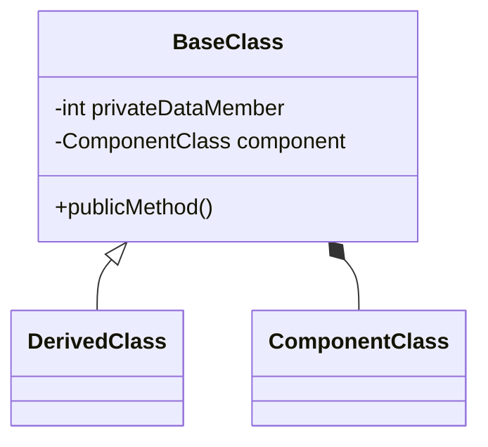

# Abstraction (10%)

Here you should describe how you have used Inheritance for Code Reuse in your solution.

//The transaction class interacts with the concession class through using its method

internal class Transaction
{
    private Film? _film; 
    private Screening? _screening; 
    private List<Concession> _concessions;
    private List<Ticket> _tickets;

    
    public Transaction()
    {
        _concessions = new List<Concession>();
        _tickets = new List<Ticket>();
    }

    // Method to add a film to the transaction
    public void AddFilm(Film film)
    {
        if (film == null)
        {
            throw new ArgumentNullException(nameof(film), "Film cannot be null");
        }

        if (_film != null)
        {
            throw new InvalidOperationException("A film has already been selected for this transaction.");
        }

        _film = film;
    }

    // Method to add a screening to the transaction
    public void AddScreening(Screening screening)
    {
        if (screening == null)
        {
            throw new ArgumentNullException(nameof(screening), "Screening cannot be null");
        }

        if (_screening != null)
        {
            throw new InvalidOperationException("A screening has already been selected for this transaction.");
        }

        _screening = screening;
    }

    // Method to add a concession to the transaction
    public void AddConcession(Concession concession)
    {
        if (concession == null)
        {
            throw new ArgumentNullException(nameof(concession), "Concession cannot be null");
        }
        _concessions.Add(concession);
    }

    // Method to add a ticket to the transaction
    public void AddTicket(Ticket ticket)
    {
        if (ticket == null)
        {
            throw new ArgumentNullException(nameof(ticket), "Ticket cannot be null");
        }
        _tickets.Add(ticket);
    }

    // Method to apply a discount for Gold members
    public void ApplyDiscount(double v)
    {
        const double discountRate = 0.25;
        foreach (var concession in _concessions)
        {
            int originalPrice = concession.PriceInPence;
            int discountedPrice = (int)(originalPrice * (1 - discountRate));
            concession.ApplyDiscount((int)(discountRate * 100));
        }
    }

    // Display transaction details
    public override string ToString()
    {
        StringBuilder sb = new StringBuilder();
        int transactionTotalInPence = 0;

        sb.AppendLine("Film:");
        if (_film != null)
        {
            sb.AppendLine(_film.ToString());
        }
        else
        {
            sb.AppendLine("No film selected.");
        }

        sb.AppendLine("Screening:");
        if (_screening != null)
        {
            sb.AppendLine(_screening.ToString());
        }
        else
        {
            sb.AppendLine("No screening selected.");
        }

        sb.AppendLine("Concessions:");
        foreach (Concession concession in _concessions)
        {
            sb.AppendLine(concession.ToString());
            transactionTotalInPence += concession.PriceInPence;
        }

        sb.AppendLine("Tickets:");
        foreach (Ticket ticket in _tickets)
        {
            sb.AppendLine(ticket.ToString());
            transactionTotalInPence += ticket.PriceInPence;
        }

        sb.AppendLine($"Total: £{transactionTotalInPence / 100.0:F2}");
        return sb.ToString();
    }
    
}  


You should use class diagrams and code snippets where appropriate.

Here is an example of a code snippet in markdown

```cs
/// <summary>
/// Prompts the user to enter an integer within a specified range.
/// </summary>
/// <param name="pMin">The minimum acceptable value (inclusive).</param>
/// <param name="pMax">The maximum acceptable value (inclusive).</param>
/// <param name="pMessage">The message to display to the user.</param>
/// <returns>An integer entered by the user within the specified range.</returns>
/// <exception cref="Exception">Thrown when the minimum value is greater than the maximum value.</exception>
public static int GetIntegerInRange(int pMin, int pMax, string pMessage)
{
  if (pMin > pMax)
  {
    throw new Exception($"Minimum value {pMin} cannot be greater than maximum value {pMax}");
  }

  int result;

  do
  {
    Console.ForegroundColor = ConsoleColor.Yellow;
    Console.WriteLine(pMessage);
    Console.WriteLine($"Please enter a number between {pMin} and {pMax} inclusive.");

    Console.ForegroundColor = ConsoleColor.Green;
    string userInput = Console.ReadLine();
    Console.ForegroundColor = ConsoleColor.Yellow;
    try
    {
      result = int.Parse(userInput);
    }
    catch
    {
      Console.WriteLine($"{userInput} is not a number");
      continue;
    }

    if (result >= pMin && result <= pMax)
    {
      return result;
    }
    Console.WriteLine($"{result} is not between {pMin} and {pMax} inclusive.");
  } while (true);
}
```

Here is an example of a class diagram in markdown



