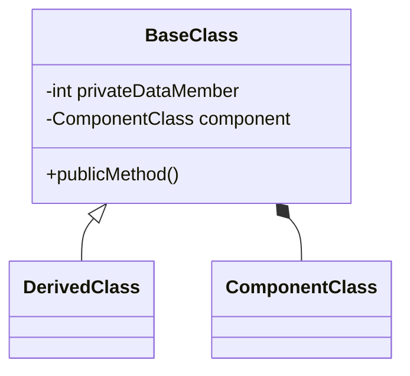

# Encapsulation and Cohesion (10%)

Here you should describe how you have used Encapsulation and Cohesion in your solution.

You should use class diagrams and code snippets where appropriate.

//Encapusulation is demonstrated where the fields have been restricted access (e.g "private Ienumerable<Screenings>_screenings") and only exposing necessary functionality

//Cohesion is demonstrated where there is multiple functionality in a class, such as menu creation and interaction

internal class SelectScreeningMenu : ConsoleMenu
{
    private IEnumerable<Screening> _screenings;
    private Transaction _transaction;
    //private MembershipService _membershipService;

    public MembershipService _membershipService { get; set; }

    public Ticket? Ticket { get; set; } // Nullable to allow for no ticket selection

    public SelectScreeningMenu(IEnumerable<Screening> screenings, Transaction transaction, MembershipService membershipService)
    {
        _screenings = screenings ?? throw new ArgumentNullException(nameof(screenings), "Screenings cannot be null");
        _transaction = transaction ?? throw new ArgumentNullException(nameof(transaction), "Transaction cannot be null");
        _membershipService = membershipService;
    }

    public override void CreateMenu()
    {
        _menuItems.Clear();

        foreach (var screening in _screenings)
        {
            _menuItems.Add(new AddScreeningMenuItem(screening, _transaction));
        }
        _menuItems.Add(new NavigateToMembershipMenuItem(_transaction, _membershipService));
        _menuItems.Add(new NavigateToTicketMenuItem(_transaction)); // Allows adding a ticket to the transaction
        //option to exit
        _menuItems.Add(new ExitMenuItem(this));
    }
    

    public override string MenuText()
    {
        return "Select a screening for the film";
    }
}


Here is an example of a code snippet in markdown

```cs
/// <summary>
/// Prompts the user to enter an integer within a specified range.
/// </summary>
/// <param name="pMin">The minimum acceptable value (inclusive).</param>
/// <param name="pMax">The maximum acceptable value (inclusive).</param>
/// <param name="pMessage">The message to display to the user.</param>
/// <returns>An integer entered by the user within the specified range.</returns>
/// <exception cref="Exception">Thrown when the minimum value is greater than the maximum value.</exception>
public static int GetIntegerInRange(int pMin, int pMax, string pMessage)
{
  if (pMin > pMax)
  {
    throw new Exception($"Minimum value {pMin} cannot be greater than maximum value {pMax}");
  }

  int result;

  do
  {
    Console.ForegroundColor = ConsoleColor.Yellow;
    Console.WriteLine(pMessage);
    Console.WriteLine($"Please enter a number between {pMin} and {pMax} inclusive.");

    Console.ForegroundColor = ConsoleColor.Green;
    string userInput = Console.ReadLine();
    Console.ForegroundColor = ConsoleColor.Yellow;
    try
    {
      result = int.Parse(userInput);
    }
    catch
    {
      Console.WriteLine($"{userInput} is not a number");
      continue;
    }

    if (result >= pMin && result <= pMax)
    {
      return result;
    }
    Console.WriteLine($"{result} is not between {pMin} and {pMax} inclusive.");
  } while (true);
}
```

Here is an example of a class diagram in markdown



