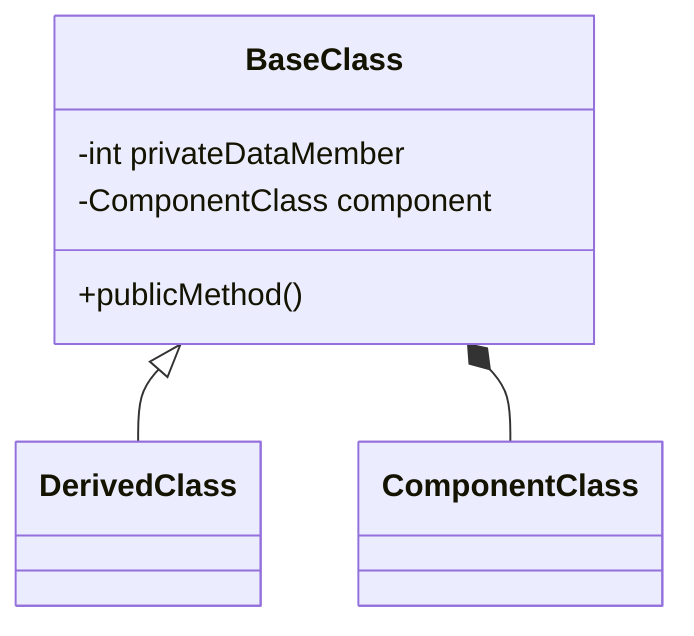

# Polymorphism (10%)

Here you should describe how you have used Polymorphism in your solution.

You should use class diagrams and code snippets where appropriate.

// As an example the SelectScreeningMenu class uses ConsoleMenu abstract class. The createMenu and MenuText are overriden methods from the ConsoleMenu class

internal class SelectScreeningMenu : ConsoleMenu
{
    private IEnumerable<Screening> _screenings;
    private Transaction _transaction;
    //private MembershipService _membershipService;

    public MembershipService _membershipService { get; set; }

    public Ticket? Ticket { get; set; } // Nullable to allow for no ticket selection

    public SelectScreeningMenu(IEnumerable<Screening> screenings, Transaction transaction, MembershipService membershipService)
    {
        _screenings = screenings ?? throw new ArgumentNullException(nameof(screenings), "Screenings cannot be null");
        _transaction = transaction ?? throw new ArgumentNullException(nameof(transaction), "Transaction cannot be null");
        _membershipService = membershipService;
    }

    public override void CreateMenu()
    {
        _menuItems.Clear();

        foreach (var screening in _screenings)
        {
            _menuItems.Add(new AddScreeningMenuItem(screening, _transaction));
        }
        _menuItems.Add(new NavigateToMembershipMenuItem(_transaction, _membershipService));
        _menuItems.Add(new NavigateToTicketMenuItem(_transaction)); // Allows adding a ticket to the transaction
        //option to exit
        _menuItems.Add(new ExitMenuItem(this));
    }
    

    public override string MenuText()
    {
        return "Select a screening for the film";
    }
}


```cs
internal class AddTicketMenuItem : MenuItem
{
    private Ticket _ticket;
    private Transaction _transaction;

    public AddTicketMenuItem(Ticket ticket, Transaction transaction)
    {
        _ticket = ticket;
        _transaction = transaction;
    }

    public override void Select()
    {
        _transaction.AddTranscationItem(_ticket);
        Console.WriteLine($"Added ticket: {_ticket.Name}");
    }

    public override string MenuText()
    {
        return _ticket.Name;
    }
}
```

Here is an example of a class diagram in markdown



