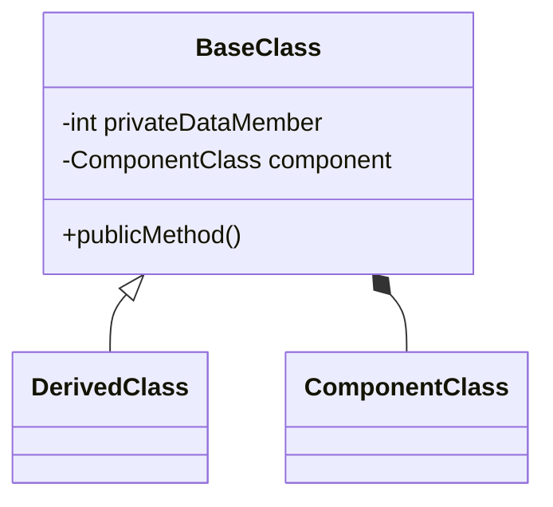

# Polymorphism (10%)

Here you should describe how you have used Polymorphism in your solution.

You should use class diagrams and code snippets where appropriate.

```cs
internal class AddTicketMenuItem : MenuItem
{
    private Ticket _ticket;
    private Transaction _transaction;

    public AddTicketMenuItem(Ticket ticket, Transaction transaction)
    {
        _ticket = ticket;
        _transaction = transaction;
    }

    public override void Select()
    {
        _transaction.AddTranscationItem(_ticket);
        Console.WriteLine($"Added ticket: {_ticket.Name}");
    }

    public override string MenuText()
    {
        return _ticket.Name;
    }
}
```

Here is an example of a class diagram in markdown


